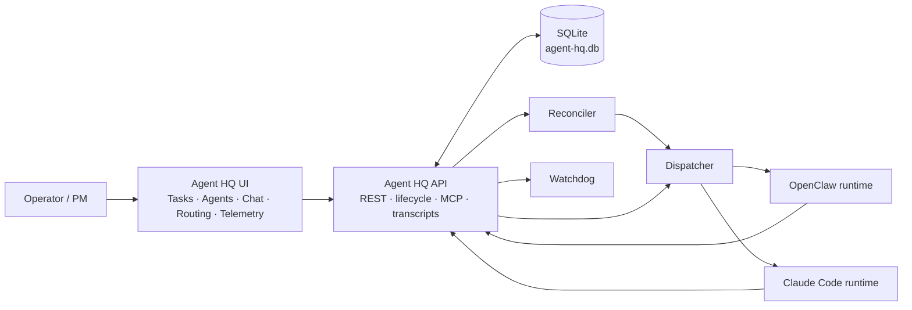
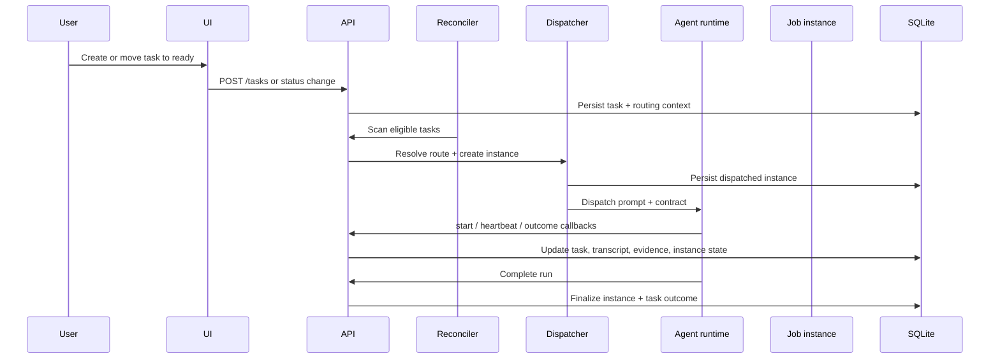

# Agent HQ

**Agent HQ** is a source-available task routing and agent orchestration system. It sits between your planning work and your AI agents — giving every run structured context, deterministic routing, and verifiable workflow evidence.

Built for teams running multiple AI agents across multiple projects, sprints, and workflow stages.


---

## What it does

| Capability | Description |
|---|---|
| **Task system** | Projects, sprints, tasks, blockers, notes, history, attachments |
| **Deterministic routing** | Rules map task state → the next responsible agent |
| **Agent orchestration** | Dispatch jobs, track live runs, record artifacts |
| **Context distribution** | Agents start with the right project/sprint/task brief |
| **Workflow evidence** | Structured evidence and gated handoffs before work can move forward |
| **Multi-runtime support** | OpenClaw, Claude Code, Webhook |
| **Contract system** | Workflow semantics separated from runtime transport |

---

## Quickstart

```bash
npm install -g @nordinit/agent-hq
agent-hq start
```

This is the recommended install path.

- `agent-hq start` now starts local mode by default.
- Use `agent-hq start --docker` only if you explicitly want the Docker Compose stack.
- `agent-hq start --no-docker` is still accepted as a compatibility alias.
- In local mode, the managed OpenClaw runtime/config live under `~/.openclaw`.
- For Agent HQ-assigned OpenClaw tools, local startup automatically configures OpenClaw to load and allow the Agent HQ capability tools plugin. Manual installs must also allow the plugin id in OpenClaw tool policy. See [plugins/openclaw-capability-tools/README.md](plugins/openclaw-capability-tools/README.md).

Open [http://localhost:3500](http://localhost:3500) to access the UI by default.

You can also run without a global install:

```bash
npx @nordinit/agent-hq start
```

Common lifecycle commands:

```bash
agent-hq start
agent-hq restart
agent-hq status
agent-hq stop
```

## Why use it

- Run multiple AI agents against real project state instead of ad hoc prompts.
- Route work deterministically by project, task type, and status.
- Keep task, review, QA, and deploy evidence in one place.
- Mix local and remote runtimes without changing the workflow model.
- Give operators a control plane for tasks, agents, chat, routing, and telemetry.

---

## Docker Compose install (alternative)

The fastest way to get a persistent, self-hosted Agent HQ running:

```bash
git clone https://github.com/mband0/agent-hq.git
cd agent-hq
docker compose up -d
```

This starts:
- `agent-hq-api` — Express/TypeScript API on port `3501`
- `agent-hq-ui` — Next.js UI on port `3500`

Data persists in a named Docker volume (`agent-hq-data`).

### Custom ports or data directory

Copy the example env file and edit before starting:

```bash
cp .env.example .env
# Edit .env: AGENT_HQ_API_PORT, AGENT_HQ_UI_PORT, NEXT_PUBLIC_API_URL if needed
docker compose --env-file .env up -d
```

See [docs/SELF_HOSTING.md](docs/SELF_HOSTING.md) for the full configuration reference and advanced setup options.

---

## Architecture overview



### Run flow



See [docs/ARCHITECTURE_OVERVIEW.md](docs/ARCHITECTURE_OVERVIEW.md) for the fuller system overview and component notes.

| Layer | Tech | Default port |
|---|---|---|
| UI | Next.js 14 (App Router) + Tailwind CSS | 3500 |
| API | Express + TypeScript | 3501 |
| Database | SQLite | — |
| Agent runtime | OpenClaw (local, optional) | 18789 |
| Agent runtime | Claude Code (local, optional) | — |
| Agent runtime | Webhook (generic HTTP, optional) | — |

---

## Core concepts

### Tasks
The unit of planned work. Each task carries a title, description, status, priority, project/sprint placement, blockers, notes, attachments, and any workflow-specific evidence fields your team uses.

### Agents
Each agent is a 1:1 mapping between an identity (name, role, session key) and an execution configuration (schedule, pre-instructions, skills, timeout, dispatch mode). Agents are assigned to projects and process tasks routed to them.

Agents support multiple runtime backends:
- **OpenClaw** — local agent with shell/file/tool access via the OpenClaw gateway
- **Claude Code** — local Claude Code agent process with CLAUDE.md management
- **Webhook** — generic HTTP dispatch to any endpoint

### Routing rules
Routing is deterministic. Rules match `(sprint, task_type, status)` and decide which agent picks up work next. Multiple rules for the same combination are allowed — the dispatcher tries all matching rules in priority order and picks the first available agent.

Workflow transitions are configured separately from agent routing. A transition maps `(current status, outcome, task type, sprint)` to the next status, while transition requirements define the evidence gates that must pass before that outcome can move the task.

### Lanes
Lanes are prompt/contract categories such as `implementation`, `review`, `release`, or `pm`. They help Agent HQ phrase the dispatch contract, but they do not make evidence fields required on their own. Required fields come only from configured transition requirement rows.

### Contracts (workflow + transport)
The contract system separates **workflow semantics** (what outcomes are valid, what evidence is required) from **runtime transport** (how the agent communicates results back). Three transport modes:
- **local** — agent runs curl against localhost
- **remote-direct** — agent makes HTTP calls to an external URL
- **proxy-managed** — agent emits structured JSON; the runtime handles callbacks

The workflow side is generated from the current task, sprint, task type, status, configured transitions, and configured gate requirements. Contract examples are examples only; the validator does not infer requirements from lane names, outcome names, or sample payloads.

### Job instances
Each dispatch creates a job instance with timestamps, session key, artifacts, heartbeat signals, and stale detection.

### Example software workflow
One common software-delivery workflow moves through verifiable states like:
```
todo → ready → dispatched → in_progress → review → qa_pass → ready_to_merge → deployed → done
```
Agent HQ can require structured evidence at each gate — for example branch name, commit SHA, QA URL, deploy target, or live verification metadata — before allowing progression. Teams using non-software workflows can define different statuses, outcomes, gates, and evidence rules. A configured field can also use `a|b` syntax when either evidence field is acceptable.

---

## UI pages

| Page | Path | Description |
|---|---|---|
| Dashboard | `/` | Stats, completed tasks, failed jobs, quick links |
| Tasks | `/tasks` | Kanban board with drag-drop, sprint sections, create task button |
| Agents | `/agents` | Agent list with status, create/edit/delete |
| Agent Detail | `/agents/[id]` | Full-page agent edit with runtime config, skills, logs, docs |
| Chat | `/chat` | Live chat with agents, transcript history, linked task display |
| Sprints | `/sprints` | Sprint list, detail view with metrics and task board |
| Capabilities | `/capabilities` | Skills library + tools registry with enable/disable toggles |
| Workspaces | `/workspaces` | Artifact browser with file editing and syntax highlighting |
| Routing | `/routing` | Routing statuses, transitions, agent rules, gate requirements |
| Logs | `/logs` | Execution logs filtered by agent/level/date |
| Telemetry | `/telemetry` | Task cycle time, QA breakdown, model usage, agent efficiency |
| Projects | `/projects` | Project CRUD with context markdown and file uploads |
| Settings | `/settings/model-routing` | Story points → model mapping configuration |

---

## Configuration reference

All configuration is via environment variables.

### API

| Variable | Default | Description |
|---|---|---|
| `PORT` | `3501` | API server port |
| `AGENT_HQ_DB_PATH` | `<repo>/agent-hq.db` | SQLite database file path |
| `AGENT_HQ_DATA_DIR` | `<repo>` | Base directory for the database (used if `AGENT_HQ_DB_PATH` is not set) |
| `AGENT_HQ_INTERNAL_BASE_URL` | `http://localhost:3501` | Internal API base URL for local agent callbacks |
| `AGENT_HQ_URL` | — | External API URL for remote agent callbacks |
| `OPENCLAW_BIN` | `openclaw` | Path to the OpenClaw CLI binary |
| `OPENCLAW_CONFIG_PATH` | `~/.openclaw/openclaw.json` | OpenClaw config file path |
| `OPENCLAW_GATEWAY_URL` | `https://127.0.0.1:18789` | OpenClaw gateway HTTPS URL |
| `OPENCLAW_HOOKS_TOKEN` | — | Gateway auth token |
| `WORKSPACE_ROOT` | `~/.openclaw/workspace` | Agent workspace root directory |
| `ANTHROPIC_API_KEY` | — | Anthropic API key (for Claude Code runtime) |
| `TELEGRAM_BOT_TOKEN` | — | Telegram bot token for notifications |
| `TELEGRAM_CHAT_ID` | — | Telegram chat ID for notifications |

### UI

| Variable | Default | Description |
|---|---|---|
| `PORT` | `3500` | UI server port |
| `NEXT_PUBLIC_API_URL` | `http://localhost:3501` | Agent HQ API base URL (set at build time for Docker) |

---

## Agent contract

Agents interact with Agent HQ via a structured callback protocol injected at dispatch time. The contract adapts based on the agent's transport mode and current workflow configuration.

### Local agents (OpenClaw, Claude Code)

```bash
# 1. Start — report session key as soon as the run begins
PUT /api/v1/instances/:id/start
{"session_key": "<sessionKey>"}

# 2. Heartbeat / progress — every 5–10 minutes or on meaningful output
POST /api/v1/instances/:id/check-in
{"stage": "heartbeat", "summary": "Still working", "session_key": "<sessionKey>"}

# 3. Blocker — if blocked before finishing
POST /api/v1/instances/:id/check-in
{"stage": "blocker", "summary": "...", "blocker_reason": "...", "session_key": "<sessionKey>"}

# 4. Task outcome — report before completing the instance
POST /api/v1/tasks/:id/outcome
{"outcome": "completed_for_review", "summary": "...", "changed_by": "<agent-slug>", "instance_id": <id>}
```

Common evidence endpoints use canonical field names:

| Evidence endpoint | Canonical fields |
|---|---|
| `PUT /api/v1/tasks/:id/review-evidence` | `review_branch`, `review_commit`, `review_url`, `summary` |
| `PUT /api/v1/tasks/:id/qa-evidence` | `qa_verified_commit`, `qa_tested_url`, `notes` |
| `PUT /api/v1/tasks/:id/deploy-evidence` | `merged_commit`, `deployed_commit`, `deploy_target`, `deployed_at` |
| `PUT /api/v1/tasks/:id/live-verification` | `live_verified_by`, `live_verified_at`, `summary` |

### Proxy-managed agents

Proxy-managed agents emit a structured JSON block at the end of their response:

```json
{
  "outcome": "completed_for_review",
  "summary": "One sentence describing what was done",
  "branch": "feature/branch-name",
  "commit": "abc1234..."
}
```

The runtime parses this block and makes lifecycle callbacks on behalf of the agent. In proxy-managed output, `branch` and `commit` are accepted as lifecycle aliases for `review_branch` and `review_commit`; direct HTTP calls should use the canonical field names above.

### Common outcomes

Outcomes are valid only when the workflow transition config allows them from the task's current status. The table below shows the default software-delivery flow, not a hardcoded universal rule.

| Outcome | Typical next status |
|---|---|
| `completed_for_review` | `review` |
| `approved_for_merge` | `ready_to_merge` (PM tasks, skips QA) |
| `qa_pass` | `qa_pass` |
| `qa_fail` | `ready` (back to dev) |
| `deployed_live` | `deployed` |
| `live_verified` | `done` |
| `blocked` | `stalled` |
| `failed` | `failed` |

---

## Running agents with Docker

Agent HQ ships a parameterized agent container template and a full fleet Compose config. See [docker/README.md](docker/README.md) for the full setup guide.

Quick start — single agent:

```bash
docker build \
  -f docker/Dockerfile.agent \
  --build-arg AGENT_ID=agency-backend \
  -t openclaw-agent:agency-backend \
  .

docker run -d \
  -e AGENT_ID="agency-backend" \
  -e OPENCLAW_MODEL="anthropic/claude-sonnet-4-6" \
  -e ANTHROPIC_API_KEY="<key>" \
  -e HOOKS_TOKEN="<token>" \
  -e GATEWAY_AUTH_TOKEN="<gw-token>" \
  -e AGENT_HQ_API_URL="http://host.docker.internal:3501" \
  -v openclaw-ws-agency-backend:/workspace \
  -p 3711:3700 \
  openclaw-agent:agency-backend
```

Full fleet (all agents):

```bash
cp docker/.env.agents.example .env.agents
# Fill in the required secrets: ANTHROPIC_API_KEY, HOOKS_TOKEN, GATEWAY_AUTH_TOKEN
# Optional: override OPENCLAW_MODEL or AGENT_HQ_API_URL if the defaults do not fit your host
docker compose -f docker/docker-compose.agents.yml --env-file .env.agents up -d
```

---

## Worktree-backed agent dispatch

Agent HQ can create a task-specific git worktree for a dispatched agent run, but it only does so when the agent record has both of these populated:
- `workspace_path`
- `repo_path`

Current implementation gate:
- `api/src/services/dispatcher.ts`
- worktree creation only runs inside:
```ts
if (job.repo_path && job.workspace_path) {
  const wtResult = createTaskWorktree({
    repoPath: job.repo_path,
    basePath,
    taskId: task.id,
    taskTitle: task.title,
    agentSlug,
  });
}
```

Important:
- `repo_path` is currently a local filesystem path to a canonical git checkout, not a remote Git URL.
- The worktree manager uses native `git worktree` operations against that local checkout.
- If `repo_path` is null, blank, or not a valid local repo path, Agent HQ falls back to the bare agent workspace root and no task repo folder/worktree is created.

Related code/docs:
- `api/src/services/worktreeManager.ts`
- `api/src/routes/agents.ts`
- `docs/architecture/remote-agent-runtime-adapter.md`
- `docs/task-591-jobs-agents-unification-spec.md`

## Contributing

See [CONTRIBUTING.md](CONTRIBUTING.md) for local setup, testing, and PR expectations.

### Philosophy

- deterministic behavior over magical behavior
- visible state over hidden state
- auditable transitions over silent mutation
- release truth that reflects reality, not aspiration

---

## License

Agent HQ is source-available under the Sustainable Use License. See [LICENSE](LICENSE).
