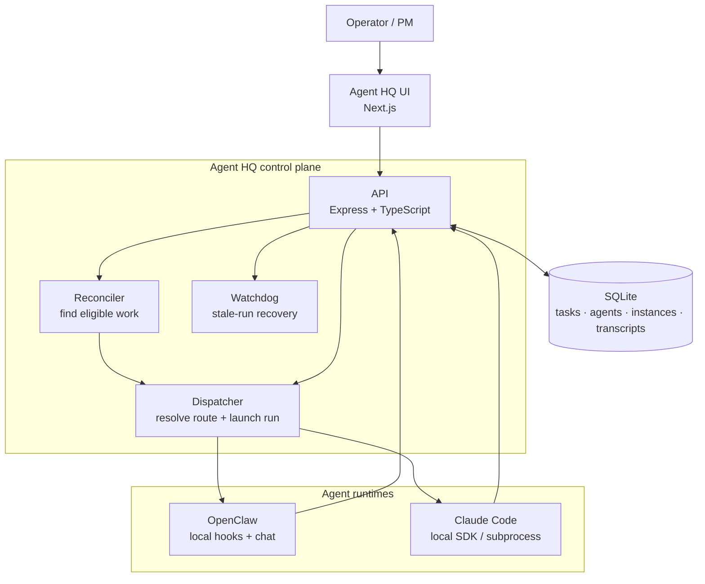
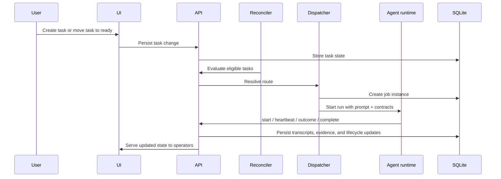

# Agent HQ Architecture Overview

This document is the public-facing system overview for Agent HQ. It complements the deeper implementation notes in [INFRASTRUCTURE.md](../INFRASTRUCTURE.md).

## System map

## Core components

- `UI`: the operator surface for tasks, agents, chat, routing, projects, sprints, logs, and telemetry.
- `API`: the central control plane. It owns task state, lifecycle transitions, transcript persistence, MCP endpoints, and runtime integration.
- `Reconciler`: periodically finds tasks that are eligible to move forward and hands them to the dispatcher.
- `Dispatcher`: resolves the correct execution lane from routing rules, creates job instances, materializes runtime context, and launches the run.
- `Watchdog`: monitors stale or orphaned runs and applies recovery behavior.
- `SQLite`: the durable system of record for projects, tasks, agents, instances, routing, artifacts, and transcripts.

## Runtime model

Agent HQ supports multiple execution backends behind one workflow model:

- `OpenClaw`: local agents with hooks, chat sessions, shell access, and workspace tools.
- `Claude Code`: local SDK/subprocess-based runs with Agent HQ-provided context and callback contracts.
The dispatcher chooses the correct runtime from the agent record. Task lifecycle and routing semantics stay consistent across runtimes.

## Primary data flow

## Routing and execution lifecycle

At a high level:

1. A task is created or moved into a routable state such as `ready`.
2. The reconciler evaluates routing rules using sprint, task type, and current status.
3. The dispatcher picks the correct route and launches a job instance.
4. The runtime sends progress and completion signals back to the API.
5. The API records transcripts, evidence, and outcome transitions.
6. The watchdog intervenes if a run becomes stale or orphaned.
